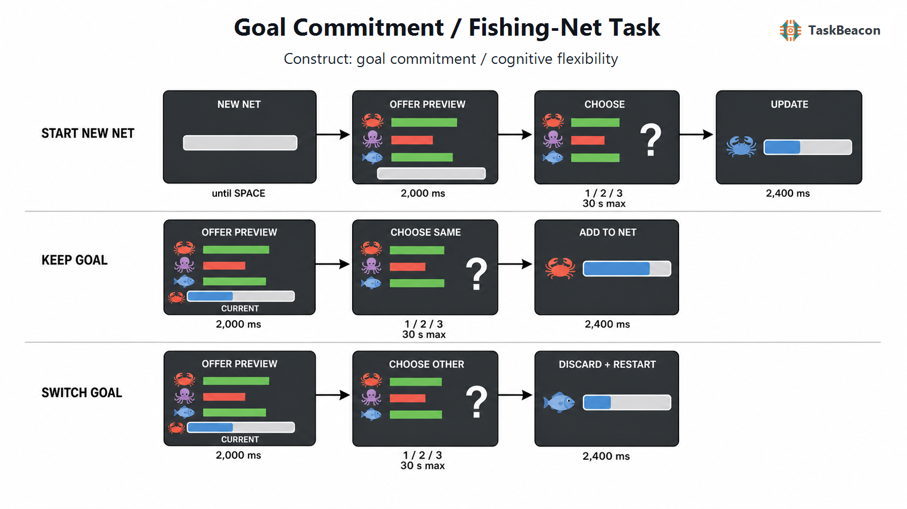

# 增量目标追求中的承诺、放弃与选择性注意：渔网任务的理论基础、实验证据与实现

持续追求能够延迟兑现的目标，要求个体在相互竞争的两类损失之间进行权衡：过早退出会使潜在收益无法实现，继续投入则可能错过已经变得更优的替代目标。传统沉没成本研究证明，不可收回的既往投入会影响后续选择，但情境问卷或一次性投资决策难以分离既往投入、剩余成本、未来收益、目标接近度与在线注意分配（Arkes & Blumer, 1985; Ronayne et al., 2021）。目标承诺/渔网任务（Goal Commitment/Fishing-Net Task）把这一问题转化为受试次预算约束的连续决策：参与者必须在保留当前积累与放弃积累、改选动态替代项之间反复选择。该范式因而能够同时估计规范价值利用、目标进度相关的坚持偏差，以及当前目标对选择性注意的占用（Holton et al., 2024）。

## 1. 范式提出与理论背景

沉没成本效应最初主要指已发生且不可回收的金钱、时间或努力继续影响理应只由未来后果决定的选择（Arkes & Blumer, 1985）。后续的跨物种觅食研究把“投入之后是否退出”与“投入之前是否接受”分开，发现时间投入对坚持的影响主要出现在已经接受目标之后，提示审议与执行可能调用不同的估值过程（Sweis et al., 2018）。不过，投入时间越长后仍留在样本中的试次也可能来自初始动机较强的选择性留存；因此，观察到坚持概率随投入增长，并不足以单独证明非理性沉没成本效应。近期有激励的实验甚至得到反向沉没成本效应，说明责任归因、损失框定和任务结构会改变效应方向（Ronayne et al., 2021）。

另一条理论脉络关注目标形成后认知系统如何优先处理目标相关信息。目标中心的学习观点认为，当前目标会改变状态表征与信息取样；实验研究也表明，形成意向承诺可抑制竞争欲望，而目标相关性会重塑价值信息的神经表征（Castegnetti et al., 2021; Cheng et al., 2023; Molinaro & Collins, 2023）。这种优先化有适应价值：持续重算所有备选方案既消耗资源，也可能破坏需要连续行动才能兑现的计划。然而，当替代方案显著改善时，同一过程会降低灵活转换。渔网任务由 Holton 等人（2024）首次提出，核心贡献是正交改变当前目标与替代目标的报价，并以计算模型给出放弃的规范基准，从而将一般的“坚持”进一步分解为价值敏感性、相对规范模型的过度坚持及目标导向注意。

## 2. 任务逻辑、流程与测量指标

每张渔网构成一个目标区段。区段开始时给定容量阈值；每个决策试次同时呈现螃蟹、章鱼和鱼三类商品的当期报价。首次选择确定当前目标商品；此后继续选择同类商品会把报价加到已有积累，改选另一类商品则先清空原积累，再把新报价计入渔网。报价可为负值，但积累量最低为零。渔网达到容量即获得一次奖励并开始新目标。整个会话按预定试次数终止，而不是保证完成固定数量的渔网，因此参与者需要最大化单位试次内完成的渔网数（Holton et al., 2024）。

原始范式中，容量从 12—72 的均匀分布抽取；三类商品初始报价独立服从均值 6、方差 1 的正态分布，随后按方差 0.8 的独立高斯随机游走变化。每类商品在每个试次另有 0.10 概率向上跳变和 0.10 概率向下跳变，幅度为相对初始锚点 3—9 单位，跳变后从新锚点继续游走。规范树搜索模型根据真实生成过程蒙特卡洛采样未来报价轨迹，以预期完成渔网所需试次数评价各选项；最大即时报价、短视累积值和假设报价固定的简单前瞻模型则构成复杂度较低的比较模型。容量—报价组合还经树搜索筛选，使规范代理通常需 4—14 个试次完成目标（Holton et al., 2024）。

主要因变量是坚持/放弃选择、放弃反应时、完成渔网数与每网所需试次数。构念解释依赖条件化对比：控制树搜索所估当前目标价值与最佳替代价值后，放弃无差异点向“继续”方向的偏移表示坚持偏差；目标进度与放弃的交互表示接近完成时额外增加的承诺；替代价值效应随进度减弱快于当前目标价值效应，则符合对替代目标注意下降的预测。空间变式在决策前短暂呈现三类图标并要求回忆位置，以当前目标图标相对替代图标的定位误差和反应时差异作为独立注意指标。由此，单纯选择同一商品不是充分的目标承诺指标，因为它同时受即时报价、已积累数量、容量、未来报价预期和动作成本影响。

原研究针对不同测量目的形成三种会话：健康成人在功能磁共振成像（functional magnetic resonance imaging, fMRI）内完成 300 个纯决策试次，随后在扫描外完成 100 个嵌入空间任务的试次；病灶样本在线完成 250 个决策试次。商品的屏幕位置逐试次随机化，使坚持不等同于重复同一按键。该设计把目标进度、当前价值和替代价值置于同一连续环境，但也意味着阶段解释应依据参数回归或模型对比，而不能把某次放弃直接归因为“诱惑”或“挫折”。

## 3. 主要行为与神经科学发现

### 3.1 规范价值、坚持偏差与目标导向注意

健康样本的选择由树搜索模型预测得优于三种简化策略，说明参与者会利用积累状态与报价动态进行一定程度的前瞻评估。即便如此，参与者仍比模型更不愿放弃当前目标，且额外坚持随渔网完成比例增加。更具区分力的结果来自价值来源的不对称变化：随着目标推进，当前目标价值和替代价值对选择的影响均下降，但替代价值的影响下降更快。该模式符合注意逐渐集中于当前目标的解释，也与目标相关证据优先进入决策的研究相一致（Holton et al., 2024; Sepulveda et al., 2020）。

空间任务提供了决策之外的验证。参与者对当前目标图标的位置回忆更准确、反应更快；追求同一目标的试次越多，当前目标图标的定位误差越小，而替代图标没有相应改善。个体的注意优势与独立会话中估计的坚持偏差相关。奖励能够快速增强视觉知觉、前瞻性注意状态能够在内侧前额叶与海马系统中预先形成，这些相邻证据支持注意优先化的可行性，但不能替代该范式内的操控证据（Cheng et al., 2021; Günseli & Aly, 2020）。

### 3.2 fMRI 与病灶证据

fMRI 结果显示，决策时的目标进度与广泛的额顶、纹状体和内侧前额叶活动相关；当前目标相对替代目标越有价值，腹内侧前额叶皮层（ventromedial prefrontal cortex, vmPFC）和纹状体活动越高，而放弃价值及实际放弃与前扣带皮层、岛叶、背外侧前额叶和辅助运动前区活动增强相关。这与觅食研究中前扣带皮层参与离开当前选项和探索替代策略的发现相衔接（Kaiser et al., 2021; Kolling et al., 2012; Tervo et al., 2021）。

更直接关联承诺的是决策间期信号：控制决策期活动及模型价值后，vmPFC 在新报价出现前仍追踪目标进度；该基线进度信号的个体差异同时预测坚持偏差和扫描外的注意优势。独立病灶研究进一步发现，vmPFC 损伤与较低坚持偏差相关，并因减少过度坚持而提高完成效率；既往 vmPFC 病灶研究也表明，该区域损伤可选择性破坏目标导向价值最大化（Holton et al., 2024; Reber et al., 2017）。病灶证据增强了因果推断，但定位结果由少数 vmPFC 病例驱动，不能据此把复杂的坚持—转换决策归结为单一区域功能。

## 4. 范式发展与主要应用

该范式的主要发展集中于测量分离，而非广泛的人群应用。纯决策版适合估计长期报价环境中的坚持偏差；空间版将同一目标状态迁移到无收益后果的位置记忆任务；fMRI 版利用决策间期检验目标状态的持续表征；病灶版则检验 vmPFC 的必要性。它由此连接了沉没成本、目标梯度、觅食式离开决策和选择性注意四类研究，同时保留每类解释的可检验对比（Holton et al., 2024）。

相关的等待范式表明，人能够依据环境的奖励时间分布调整坚持，但即使提供反事实反馈、概率描述或预先经验，仍需在决策情境中通过反馈学习接近合适的退出策略（Lempert et al., 2023; McGuire & Kable, 2015）。序列觅食研究也强调，前瞻、坚持和策略转换依赖对机会成本与环境状态的联合估计（Kolling et al., 2018）。这些结果说明渔网任务可用于研究目标承诺如何随环境可预测性、学习史或注意负荷改变；现有发表证据尚不足以建立发展常模、精神或神经疾病诊断效度。除病灶研究外，也未见该任务在临床样本中的系统应用；未检索到使用该任务的已发表 EEG/ERP 研究，因而目前不能确定坚持偏差的毫秒级时间进程。

## 5. 测量效度与解释边界

渔网任务的构念效度来自多重收敛：规范模型控制未来机会成本，空间任务提供决策外注意指标，fMRI 与病灶数据分别提供相关和必要性证据。原研究中坚持偏差跨两次会话的组内相关系数为 0.76，但置信区间较宽；这支持初步的个体差异稳定性，尚不能替代独立实验室、不同日程与不同样本量下的信度评估（Holton et al., 2024）。稳定的群体效应也不自动保证个体排序可靠，尤其当指标由有限放弃试次、拟合斜率和无差异点共同决定时（Hedge et al., 2018）。

解释时至少需要控制四类混淆。第一，目标进度与已投入试次、剩余容量及成功接近度相关，单独的进度效应可能混合目标梯度和沉没投入。第二，树搜索仅在研究者设定的报价生成模型、效用函数和时间成本下近似最优，参与者对环境的主观信念不同不必然表示偏差。第三，固定总试次数与绩效奖金使机会成本具有现实后果；若取消激励、缩短任务或改变报价跳变率，策略及测量精度可能改变。第四，反应时还受按键映射、选择难度与运动准备影响。因而，完成渔网数、坚持率或 vmPFC 活动均不宜单独作为“意志力”指标，更不能用于个体临床诊断。

## 6. TaskBeacon 中的任务实现

### 6.1 任务资源与访问入口

| 资源 | ID | 用途 | 地址 |
|---|---|---|---|
| 完整行为实验源码 | T000110 | PsychoPy/PsyFlow 行为采集版 | [GitHub](https://github.com/TaskBeacon/T000110-goal-commitment-fishing-net-task) |
| 浏览器版源码 | H000110 | 与当前行为流程对齐的网页预览 | [GitHub](https://github.com/TaskBeacon/H000110-goal-commitment-fishing-net-task) |
| 在线运行入口 | H000110 | 直接体验浏览器行为版 | [TaskBeacon Web Runner](https://taskbeacon.github.io/psyflow-web/?task=H000110-goal-commitment-fishing-net-task) |

TaskBeacon 当前 T000110 是中文、单区段、100 个决策试次的行为基线，不包含原研究的空间位置记忆插入任务或 fMRI 采集。H000110 保留相同的 100 试次、报价生成、时序、选择和计分规则，仅以浏览器显示与输入替代 PsychoPy 环境；它适合流程预览与行为运行，不是 fMRI 或临床采集版本的等价替代。

### 6.2 实现流程与关键参数

*图 1. TaskBeacon 当前行为版的试次流程。新渔网首先呈现空容量条，参与者按空格继续；随后螃蟹、章鱼和鱼三项报价以每试次随机的上、中、下位置呈现 2,000 ms，绿色条表示正报价、红色条表示负报价。问号出现后，参与者在最长 30 s 内按 1、2、3 选择上、中、下项目。若所选商品与当前商品相同，报价加入已有积累；若不同，则先放弃全部已有积累，再以新报价建立目标；负报价使积累减少但不低于零。更新状态呈现 2,400 ms，达到容量得 1 分并在下一试次启动新渔网。容量从 12—72 抽取；初始报价为均值 6、标准差 1 的独立正态抽样，报价按标准差 √0.8 的随机游走演化，每类商品每试次分别有 0.10 概率向上或向下跳变 3—9 单位。容量—初始报价组合仅在规范模拟预计 4—14 个试次可完成时接受。*

| 参数 | 当前设置 | 分析含义 |
|---|---:|---|
| 会话长度 | 100 个决策试次 | 最终一张网可未完成 |
| 报价预览 | 2.0 s | 反应前固定观察期 |
| 选择窗口 | 最长 30 s | 1/2/3 对应随机位置 |
| 状态更新 | 2.4 s | 显示坚持或放弃后的积累 |
| 容量与初始报价 | 12—72；N(6, 1²) | 控制目标难度与起始收益 |
| 漂移与跳变 | SD=√0.8；上/下各 0.10，幅度 3—9 | 产生渐变与突发转换压力 |
| 主要输出 | 坚持/放弃、反应时、放弃量、放弃时进度、完成网数 | 支持选择、效率与进度相关分析 |

该实现每试次重排商品位置，以降低目标坚持与按键重复的混淆；超时不更新当前商品或积累。现有仓库文件只确认完成渔网增加任务内积分，无法确认积分是否兑换为实际金钱。与原始研究相比，100 试次纯决策设计降低了负担，但用于稳定估计个体树搜索参数和坚持偏差的信息量也少于原研究合并的 400 个健康成人试次，正式研究应据先验效应量和参数恢复结果确定样本量与试次数。

## 参考文献

Arkes, H. R., & Blumer, C. (1985). The psychology of sunk cost. *Organizational Behavior and Human Decision Processes, 35*(1), 124–140. https://doi.org/10.1016/0749-5978(85)90049-4

Castegnetti, G., Zurita, M., & De Martino, B. (2021). How usefulness shapes neural representations during goal-directed behavior. *Science Advances, 7*(15), eabd5363. https://doi.org/10.1126/sciadv.abd5363

Cheng, P. X., Rich, A. N., & Le Pelley, M. E. (2021). Reward rapidly enhances visual perception. *Psychological Science, 32*(12), 1994–2004. https://doi.org/10.1177/09567976211021843

Cheng, S., Zhao, M., Tang, N., Zhao, Y., Zhou, J., Shen, M., & Gao, T. (2023). Intention beyond desire: Spontaneous intentional commitment regulates conflicting desires. *Cognition, 238*, 105513. https://doi.org/10.1016/j.cognition.2023.105513

Günseli, E., & Aly, M. (2020). Preparation for upcoming attentional states in the hippocampus and medial prefrontal cortex. *eLife, 9*, e53191. https://doi.org/10.7554/eLife.53191

Hedge, C., Powell, G., & Sumner, P. (2018). The reliability paradox: Why robust cognitive tasks do not produce reliable individual differences. *Behavior Research Methods, 50*(3), 1166–1186. https://doi.org/10.3758/s13428-017-0935-1

Holton, E., Grohn, J., Ward, H., Manohar, S. G., O’Reilly, J. X., & Kolling, N. (2024). Goal commitment is supported by vmPFC through selective attention. *Nature Human Behaviour, 8*(7), 1351–1365. https://doi.org/10.1038/s41562-024-01844-5

Kaiser, L. F., Gruendler, T. O. J., Speck, O., Luettgau, L., & Jocham, G. (2021). Dissociable roles of cortical excitation-inhibition balance during patch-leaving versus value-guided decisions. *Nature Communications, 12*, 904. https://doi.org/10.1038/s41467-020-20875-w

Kolling, N., Behrens, T. E. J., Mars, R. B., & Rushworth, M. F. S. (2012). Neural mechanisms of foraging. *Science, 336*(6077), 95–98. https://doi.org/10.1126/science.1216930

Kolling, N., Scholl, J., Chekroud, A., Trier, H. A., & Rushworth, M. F. S. (2018). Prospection, perseverance, and insight in sequential behavior. *Neuron, 99*(5), 1069–1082.e7. https://doi.org/10.1016/j.neuron.2018.08.018

Lempert, K. M., Schaefer, L., Breslow, D., Peterson, T. D., Kable, J. W., & McGuire, J. T. (2023). Statistical information about reward timing is insufficient for promoting optimal persistence decisions. *Cognition, 237*, 105468. https://doi.org/10.1016/j.cognition.2023.105468

McGuire, J. T., & Kable, J. W. (2015). Medial prefrontal cortical activity reflects dynamic re-evaluation during voluntary persistence. *Nature Neuroscience, 18*(5), 760–766. https://doi.org/10.1038/nn.3994

Molinaro, G., & Collins, A. G. E. (2023). A goal-centric outlook on learning. *Trends in Cognitive Sciences, 27*(12), 1150–1164. https://doi.org/10.1016/j.tics.2023.08.011

Reber, J., Feinstein, J. S., O’Doherty, J. P., Liljeholm, M., Adolphs, R., & Tranel, D. (2017). Selective impairment of goal-directed decision-making following lesions to the human ventromedial prefrontal cortex. *Brain, 140*(6), 1743–1756. https://doi.org/10.1093/brain/awx105

Ronayne, D., Sgroi, D., & Tuckwell, A. (2021). Evaluating the sunk cost effect. *Journal of Economic Behavior & Organization, 186*, 318–327. https://doi.org/10.1016/j.jebo.2021.03.029

Sepulveda, P., Usher, M., Davies, N., Benson, A. A., Ortoleva, P., & De Martino, B. (2020). Visual attention modulates the integration of goal-relevant evidence and not value. *eLife, 9*, e60705. https://doi.org/10.7554/eLife.60705

Sweis, B. M., Abram, S. V., Schmidt, B. J., Seeland, K. D., MacDonald, A. W., III, Thomas, M. J., & Redish, A. D. (2018). Sensitivity to “sunk costs” in mice, rats, and humans. *Science, 361*(6398), 178–181. https://doi.org/10.1126/science.aar8644

Tervo, D. G. R., Kuleshova, E., Manakov, M., Proskurin, M., Karlsson, M., Lustig, A., Behnam, R., & Karpova, A. Y. (2021). The anterior cingulate cortex directs exploration of alternative strategies. *Neuron, 109*(11), 1876–1887.e6. https://doi.org/10.1016/j.neuron.2021.03.028
